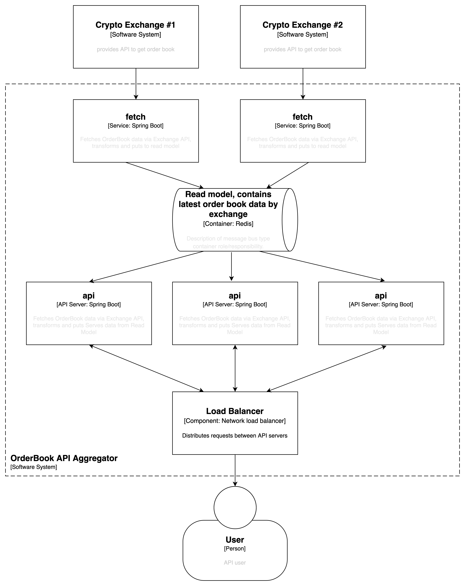
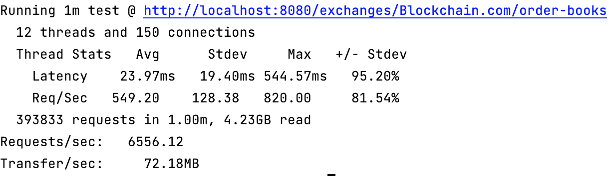

## Cryptocurrency exchange API aggregator

### Functionality:
1. Aggregate order book data from multiple cryptocurrency exchanges
2. Provide aggregated data via REST API

### Pre-requisites:
* Docker

### Architecture

See `solution-container-diagram.svg` (diagrams.net format).
C4-style, container level diagram.



### Usage

start everything:

`docker-compose up -d --build`

API interactive documentation:

`http://localhost:8080/swagger-ui/index.html`

OpenAPI spec:

`http://localhost:8080/v3/api-docs`


### Quality attributes (non-functional requirements)

#### 1. Modifiability: integration with other cryptocurrency exchanges

Currently only integration with https://api.blockchain.com/v3/ is implemented.
To add a new exchange, create a new service from `com.aggregator.fetch`.
You'll only need a new implementation `com.aggregator.domain.ExchangeFetchService`, specific to the exchange you're integrating with.

#### 2. Testability 

The solution is covered with unit, webMvc and integration tests. 

#### 3. Performance

Solution is horizontally scalable.
1. multiple `api` instances should be deployed in different regions, matching user's geography. CDN won't help here as TTL of the data provided is very short.


2. `fetch` instances require only multiple instances for achieving required availability characteristics.


3. Horizontal scalability of data storage - Redis currently - is possible, but not necessarily required for performance characteristics:
    Redis load from single `api` instance is constant regardless requests count API receives.

Latency is limited by the update frequency/latency of the cryptocurrency exchange API we integrate with.

Single instance of `api` is expected to handle ~6000-7000 requests per second, 25ms response time average. No additional improvements are made on this characteristic as target is unclear.
```
Environment: 3 services - `fetch`, `api`, `redis` inside docker-compose with 6 CPU/8GB RAM assigned, data from 1 exchange available.
Peak resources usage by `api` service is 4CPU, ~660Mb RAM.
``` 




#### 4. Availability: zero downtime possible

No restrictions on deployment strategy (canary or blue-green deployment) of API nodes makes deployment without downtime possible.


Having multiple instances of `fetch` instances for the same exchange will allow to achieve the same for `fetch` functionality.
Deployment in multiple availability zones is advised. Regions depend on regions where API servers of particular exchanges are located. 

#### 5. Operational complexity

Due to decoupled design of `api` and `fetch` modules, all the parts of the solution could be deployed separately.
Redis is available as fully-managed service in each mainstream public cloud, as well as load balancer for `api` instances.

Operational risks are low - Redis keeps only data the latest order book data, which becomes obsolete in seconds, so losing/clearing it is not an issue.
Api instances relies on their own local cache, which lowers availability requirements for Redis operations like restarts, change depoloyment options etc. 

Monitoring and logging are not implemented.